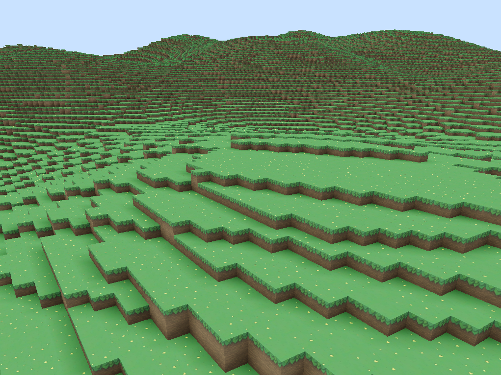

# DwarfQuest
One day, it will be a RPG game with infinite procedurally generated voxel worlds, lots of biomes, creatures and stuff.<br>
Right now i'm just writing the engine and some fundamental things.




## Installation
### Linux
You will need:
- make
- cmake 3.15+
- libsdl2-dev

`sudo apt-get install make cmake libsdl2-dev`

Then clone the repo in your machine and proceed to build.
```
git clone https://github.com/Ekozmaster/DwarfQuest.git
cd DwarfQuest
mkdir build
cd build
cmake ..
make DwarfQuest
./DwarfQuest
```

### Windows
- Coming soon. I'll make a step-by-step soon, just need to clone and build the project on a new machine.
- I'm using Visual Studio Community + vcpkg. If you known your way around them you can build by yourself. Just remember to run Visual Studio as adm, as cmake requires privileges to make symlinks to the `Assets` directory.
